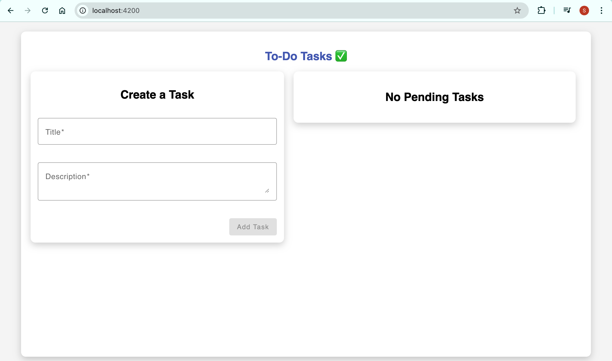

# to-do-tasks-coveragex

# 1. clone the repo using below command:

git clone https://github.com/SajidAhmed0/to-do-tasks-coveragex.git

# 2. then move to the folder using below command:

cd to-do-tasks-coveragex

# 3. then run the docker using below command:

docker-compose up --build

# 4. after fully run you can check the website:

http://localhost:4200/

- Make sure there is no port conflicts

# Test for backend

- mvn clean - clean the target folder
- mvn test - test all the unit tests
- mvn verify - test all the integration test
  after mvn verify you can see test coverage report in target/site/jacoco/index.html

# Test for frontend

- ng test - will execute all the unit test cases

# Sample UI

